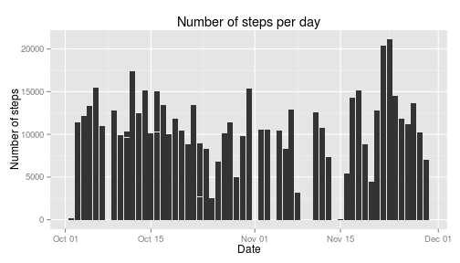
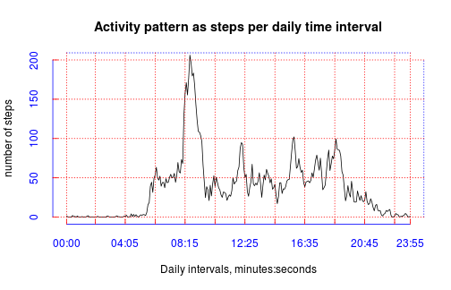
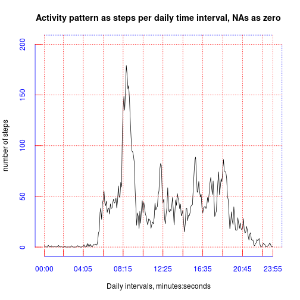
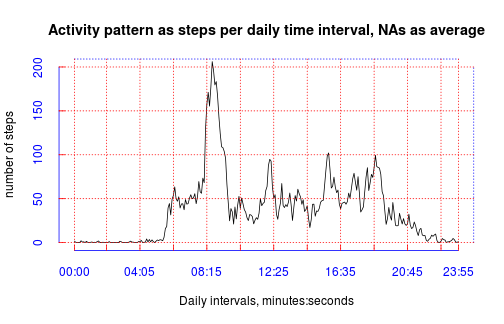
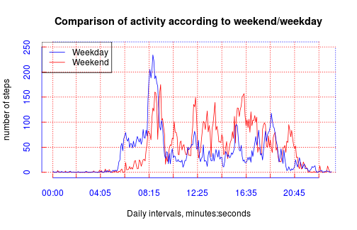

## Loading and preprocessing the data

Under the assumption that the target file is in the local
directory where the script is running the following code 
loads it into memory:


```r
defaultFileName <- "activity.csv"
if( !file.exists( file.path(defaultFileName))) {
    defaultFileName <- unzip( zipfile="activity.zip" )  
}
loaded_data <- suppressWarnings(read.csv(file = defaultFileName, 
                                 header=TRUE,
                                 quote='"',
                                 stringsAsFactors=FALSE,
                                 encoding="UTF-8"))
rm(defaultFileName)
```
The result is a data frame called `loaded_data`:


```
## 'data.frame':	17568 obs. of  3 variables:
##  $ steps   : int  NA NA NA NA NA NA NA NA NA NA ...
##  $ date    : chr  "2012-10-01" "2012-10-01" "2012-10-01" "2012-10-01" ...
##  $ interval: int  0 5 10 15 20 25 30 35 40 45 ...
```
A few of the first, last, and some intermediate rows look as follows:

```
##   steps       date interval
## 1    NA 2012-10-01        0
## 2    NA 2012-10-01        5
## 3    NA 2012-10-01       10
```

```
##       steps       date interval
## 12308     7 2012-11-12     1735
## 12309    41 2012-11-12     1740
## 12310     7 2012-11-12     1745
```

```
##       steps       date interval
## 17566    NA 2012-11-30     2345
## 17567    NA 2012-11-30     2350
## 17568    NA 2012-11-30     2355
```
Before proceeding it is a good idea to transform the dates from strings 
into date format.

```r
clean_data <- loaded_data
clean_data$date <- as.Date(x= clean_data$date,format="%Y-%m-%d")
str(clean_data)
```

```
## 'data.frame':	17568 obs. of  3 variables:
##  $ steps   : int  NA NA NA NA NA NA NA NA NA NA ...
##  $ date    : Date, format: "2012-10-01" "2012-10-01" ...
##  $ interval: int  0 5 10 15 20 25 30 35 40 45 ...
```

## What is mean total number of steps taken per day?

First a histogram of steps per day was generated with ggplot
`geom_bar`:


```r
require(ggplot2)
## The data is already in the long format so ggplot can be used to generate the
## histogram
ggplot(data=clean_data, aes(x=date,y=steps)) +
    geom_bar(stat="identity") +
    labs(title="Number of steps per day") +
    labs(x= "Date", y= "Number of steps") 
```

```
## Warning: Removed 2304 rows containing missing values (position_stack).
```

 

Then the mean and median of the average number of steps per day
was computed from a transformation of the `steps`vector
of the `clean_data` data frame using the `mean` function
and the common date for each entry as the criterion for filtering
using the R function `tapply`.


```r
count_steps_per_day <-tapply(X=clean_data$steps,INDEX=clean_data$date,sum)
```
Finally the mean and median of the steps per day are computed:


```r
mean_steps_per_day <- mean(count_steps_per_day, na.rm=TRUE)
median_steps_per_day <- median(count_steps_per_day, na.rm=TRUE)
```
The values are as follows:


```
## [1] "Mean steps per day  =  10766.1886792453"
```

```
## [1] "Median steps per day =  10765"
```

These values check with those plotted in the histogram according to visual
inspection of the y-axis values.

## What is the average daily activity pattern?

The original data frame has the running time in intervals of 5 minutes, expressed 
as hours and seconds from 0 to 2355 for each of the 61 days of data (31 in October and 30 in November).

I decided to convert those intervals to running minutes for each 24 hour period
(24*60/5=288 5-minute time markers) for 61 days. 
The following code creates a vector called `vector_minutes_for_61days` 
with these daily running 5-minute intervals from 0 to 1435. 
That vector will be used for plotting and extracting time for specific values of interest.


```r
vector_of_minutes_per_day <- (0:287)*5
vector_minutes_for_61days <- rep(x=vector_of_minutes_per_day, times=61)
```

Then a new vector with the mean number of steps reported at each of the time intervals
is created, the `NA` are removed:


```r
steps_per_interval<- tapply(X=clean_data$steps, 
                            vector_minutes_for_61days, 
                            FUN=mean,
                            na.rm=T,
                            simplify=TRUE)
```

Now the maximum value of average steps per 5-minute interval can be extracted directly:

[1] "max( steps_per_interval ) = 206 steps"

From the vector of average steps per 5 minute intervals the time this maximum
happens during the day is computed at 8:35 a.m..


The series plot was generated with the following code:


```r
plotStepDailyAverages <- function( v_of_steps_per_interval, title ) {
    plot(x=names(v_of_steps_per_interval),
         y=v_of_steps_per_interval, 
         xlab="Daily intervals, minutes:seconds", ylab="number of steps",
         main= title,
         type="l",
         ylim=c(-1,201),
         pch=7, axes=FALSE)
    Axis(side=1,
         at=vector_of_minutes_per_day[c(1,25,50,75,100,125,150,175,200,225,250,275,288)],
         labels= prettylbls[c(1,25,50,75,100,125,150,175,200,225,250,275,288)],
         col='blue', col.ticks = 'red', col.axis = 'blue',
         tck = 0.03, xaxs="r")
    Axis(side=3,
         at=vector_of_minutes_per_day[c(1,25,50,75,100,125,150,175,200,225,250,275,288)],
         labels= c("","","","","","","","","","","","",""),
         col = 'blue', col.ticks = 'red', col.axis = 'blue',
         las=2, tck = 1, # 100% of width or "grid lines on"
         lty= "dotted", xaxs="r")
    Axis(side=2,
         at=c(0,50,100,150,200),
         labels= c("0","50","100", "150", "200"),
         col='blue', col.ticks = 'red', col.axis = 'blue',
         tck = 0.03, xaxs="r")
    Axis(side=4,
         at=c(0,50,100,150,200),
         labels= c("","","", "", ""),     
         col = 'blue', col.ticks = 'red', col.axis = 'blue',
         las=2, tck = 1, # 100% of width or "grid lines on"
         lty="dotted", xaxs="r")
}
plotStepDailyAverages(steps_per_interval, "Activity pattern as steps per daily time interval")
```

 


## Imputing missing values

The number of days that contain `NA` can be computed with a table
over a logical vector testing for `NA` in the vector that
contains the count of the number of steps per day.


```r
count_steps_per_day <-tapply(X=clean_data$steps,INDEX=clean_data$date,sum)
table(is.na(count_steps_per_day))
```

```
## 
## FALSE  TRUE 
##    53     8
```

There are 8 days that had `NA` data in them.

However the total number of actual `NA` readings can be computed with th following 
similar R code:


```r
table(is.na(clean_data$steps))
```

```
## 
## FALSE  TRUE 
## 15264  2304
```
So there are 2304 `NA` entries in the `step`
column.

They can be filled in a number of ways:

    * with zero.
    * with the average number of steps per interval computed in the previous non-empty step.
    * with the average steps for the same time interval across all days.
    * with the average steps for the same weekday or weekend day.
    * with the average of the two non-empty neighbour intervals.

### Replazing `NA`s with zero

Let's try the first strategy:


```r
# auxiliary functions:
replaceNAforValue <- function( vect, indx, val) {
    if ( is.na( vect ) )
        val
    else
        vect
}
prepareVecOfNewValues <- function( vect, initial_val) {
    f<-function(x_val) {
        if (is.na(x_val))
            initial_val
        else
            x_val
    }
    # build vector in one pass:
    sapply(X=vect,FUN=f)
}
# a vector of indexes
v_of_indx <-(row(clean_data))[,1]
# a vector of replacement values:
v_of_replacements <- prepareVecOfNewValues( clean_data$steps, as.numeric(0))

l_of_replacements_for_na <- Map( f=replaceNAforValue, # function to map
                              clean_data$steps, # vector of first arg to f 
                              v_of_indx,  # vector of second arg to f
                              v_of_replacements) # vector of third arg to f

v_of_zeros_for_nas <- unlist(l_of_replacements_for_na)
```

Now let's compute the new steps per interval activity:


```r
steps_per_interval_nas_as_zero <- tapply(X=v_of_zeros_for_nas,
                                         vector_minutes_for_61days, 
                                         FUN=mean,
                                         na.rm=T,
                                         simplify=TRUE)
plotStepDailyAverages(steps_per_interval_nas_as_zero, "Activity pattern as steps per daily time interval, NAs as zero")
```

 

The effect is to lower the average because of the introduction of zeros.
Now the maximum number of steps per 5-minute interval is:

[1] "max( steps_per_interval_nas_as_zero ) = 179 steps"

From this new vector of average steps per 5 minute intervals the time this maximum
happens during the day is computed at 8:35 a.m.,
so it does not change with respect to removing the `NA`s. The effect is only to scale down the 
results but it does not shift the time scale.


### Replacing `NA`s with the average steps for the same time interval across all days

Replacing the `NA`s for the average steps per 5-minute interval as computed above reverts to
the same curve because now the averages.


```r
prepareVecOfNewValuesAsAvg <- function( vect, avg) {
    f<-function(x_val, y_val) {
        if (is.na(x_val))
            y_val
        else
            x_val
    }
    # build vector in one pass:
    as.vector(mapply(FUN=f,vect,avg,SIMPLIFY=T))
}

avg_step_vect= rep(x=steps_per_interval,times=61)

v_of_replacements_avg <- prepareVecOfNewValuesAsAvg( clean_data$steps, avg_step_vect )


l_of_replacements_for_na_as_avg <- Map( f=replaceNAforValue, # function to map
                                 clean_data$steps, # vector of first arg to f 
                                 v_of_indx,  # vector of second arg to f
                                 v_of_replacements_avg) # vector of third arg to f

v_of_replacements_for_na_as_avg <- unlist(l_of_replacements_for_na_as_avg)

steps_per_interval_nas_as_avg <- tapply(X=v_of_replacements_for_na_as_avg,
                                         vector_minutes_for_61days, 
                                         FUN=mean,
                                         na.rm=T,
                                         simplify=TRUE)

plotStepDailyAverages(steps_per_interval_nas_as_avg, 
                      "Activity pattern as steps per daily time interval, NAs as average")
```

 

## Are there differences in activity patterns between weekdays and weekends?


```r
clean_data$weekday_name <- weekdays(clean_data$date)

clean_data$weekday_factor <- as.factor(sapply(clean_data$weekday_name, 
                                    FUN=function(x) ifelse(x %in% c("Saturday","Sunday"), "Weekend", "Weekday")))

v_steps_per_interval_weekdays <- clean_data$steps[clean_data$weekday_factor %in% c("Weekday")]

vector_minutes_for_61days_weekdays <- vector_minutes_for_61days[clean_data$weekday_factor %in% c("Weekday")]


steps_per_interval_weekdays <- tapply(X=v_steps_per_interval_weekdays,
                                      vector_minutes_for_61days_weekdays, 
                                      FUN=mean,
                                      na.rm=T,
                                      simplify=TRUE) 


v_steps_per_interval_weekends <- clean_data$steps[clean_data$weekday_factor %in% c("Weekend")]

vector_minutes_for_61days_weekends <- vector_minutes_for_61days[clean_data$weekday_factor %in% c("Weekend")]

steps_per_interval_weekends <- tapply(X=v_steps_per_interval_weekends,
                                      vector_minutes_for_61days_weekends, 
                                      FUN=mean,
                                      na.rm=T,
                                      simplify=TRUE)

plot(x=vector_of_minutes_per_day,
     y=steps_per_interval_weekends, 
     xlab="Daily intervals, minutes:seconds", ylab="number of steps",
     main='Comparison of activity according to weekend/weekday',
     type="l",
     ylim=c(-1,250),
     xlim=c(-1,1400),
     pch=7, axes=FALSE,
     col="RED")
Axis(side=1,
     at=vector_of_minutes_per_day[c(1,25,50,75,100,125,150,175,200,225,250,275,300,325,350)],
     labels= prettylbls[c(1,25,50,75,100,125,150,175,200,225,250,275,300,325,350)],
     col='blue', col.ticks = 'red', col.axis = 'blue',
     tck = 0.03, xaxs="r")
Axis(side=3,
     at=vector_of_minutes_per_day[c(1,25,50,75,100,125,150,175,200,225,250,275,300,325,350)],
     labels= c("","","","","","","","","","","","","","",""),
     col = 'blue', col.ticks = 'red', col.axis = 'blue',
     las=2, tck = 1, # 100% of width or "grid lines on"
     lty= "dotted", xaxs="r")
Axis(side=2,
     at=c(0,50,100,150,200,250),
     labels= c("0","50","100", "150", "200","250"),
     col='blue', col.ticks = 'red', col.axis = 'blue',
     tck = 0.03, xaxs="r")
Axis(side=4,
     at=c(0,50,100,150,200,250),
     labels= c("","","", "", "",""),     
     col = 'blue', col.ticks = 'red', col.axis = 'blue',
     las=2, tck = 1, # 100% of width or "grid lines on"
     lty="dotted", xaxs="r")
lines(vector_of_minutes_per_day,
      steps_per_interval_weekdays,
      type="l",
      col = "BLUE")    

legend("topleft", c("Weekday","Weekend"), lty=c(1,1), lwd=c(1,1), col=c("blue","red"))
```

 

So there is a difference in the trends between weekdays and weekends.
The subject in this study shows more intense and earlier peaks of activity
measured as steps per 5-minute interval on  weekdays than on weekends.
However the mean and mediam show that the activity is more extensive on
weekends indicating that the individual may be more
physically active in those days in spite of starting later in the morning.


```r
hour_of_day_for_max_steps <- floor(as.numeric(names(which.max(x=steps_per_interval_weekends)))/60)
minutes_of_day_for_max_steps <- as.numeric(names(which.max(x=steps_per_interval_weekends))) %% 60
maxsteps<-round(x=max(steps_per_interval_weekends), digits=0)
paste0("max( steps_per_interval_weekends ) = ",
       maxsteps, 
       " steps, occuring at ", hour_of_day_for_max_steps, ":", minutes_of_day_for_max_steps)
```

```
## [1] "max( steps_per_interval_weekends ) = 175 steps, occuring at 9:15"
```

```r
mean_steps_per_day <- mean(steps_per_interval_weekends, na.rm=TRUE)
median_steps_per_day <- median(steps_per_interval_weekends, na.rm=TRUE)
```

```
## [1] "Mean steps per weekend day  =  43.1"
```

```
## [1] "Median steps per weekend day =  32"
```

```r
hour_of_day_for_max_steps <- floor(as.numeric(names(which.max(x=steps_per_interval_weekdays)))/60)
minutes_of_day_for_max_steps <- as.numeric(names(which.max(x=steps_per_interval_weekdays))) %% 60
maxsteps<-round(x=max(steps_per_interval_weekdays), digits=0)
```

```
## [1] "max( steps_per_interval_weekdays ) = 234 steps, occuring at 8:35"
```

```r
mean_steps_per_day <- mean(steps_per_interval_weekdays, na.rm=TRUE)
median_steps_per_day <- median(steps_per_interval_weekdays, na.rm=TRUE)
```

```
## [1] "Mean steps per weekend day  =  35.3"
```

```
## [1] "Median steps per weekend day =  24"
```
